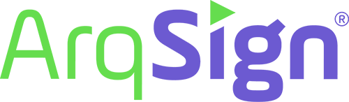

    
    

    

## API de integração ArqSign e Feegow

"Esta API tem como objetivo realizar um 'de-para', que consiste em estabelecer a conexão entre dois sistemas distintos, mapeando e traduzindo dados de um formato para o outro. Através dessa integração, a API permite que informações de um sistema sejam convertidas para o formato esperado pelo outro, garantindo a comunicação e a troca de dados entre eles de maneira eficiente e segura. Essa solução pode envolver a transformação de dados, validações de integridade e aplicação de regras de negócios específicas, dependendo das necessidades dos sistemas envolvidos
